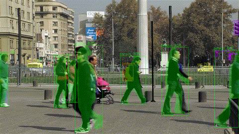

# NEW: Locally running GenAI LLM's with the new Hailo 10H accelerator

The Hailo-10H is the industry’s first edge AI accelerator to bring immersive generative AI capabilities directly to edge devices. Featuring 40 TOPS of INT4 performance and exceptional power efficiency, the Hailo-10H builds on the success of the market-leading Hailo-8 with a second-generation neural core architecture that is even more powerful and scalable.
Hailo-10H includes a direct DDR interface, allowing it to scale for large models such as LLMs, VLMs, Stable Diffusion, and more.

[GenAI Example applications](hailo_apps/gen_ai_apps/Examples/README.md)

# Hailo Applications
[](https://deepwiki.com/hailo-ai/hailo-apps-infra)

Welcome to the Hailo Applications repository! This project provides a foundational infrastructure, reusable components, and practical examples for building and deploying high-performance GenAI & AI applications using Hailo hardware accelerators: Hailo 8 & Hailo 10.

It includes everything you need to get started with locally running GenAI LLM models, as well as computer vision pipelines on both x86_64 Ubuntu systems and Raspberry Pi platforms.

- **Ready-to-use AI pipelines** for object detection, pose estimation, and more.
- **Modular infrastructure** for rapid development and custom applications.
- **Packaged as a Python library** for easy integration into your own projects.

Visit the [Hailo Official Website](https://hailo.ai/) and [Hailo Community Forum](https://community.hailo.ai/) for more information.

## Getting Started


### Hardware and Software Installation

For detailed instructions on setting up your hardware, including both x86_64 Ubuntu systems and Raspberry Pi devices, please refer to the [Full Installation Guide](./doc/user_guide/installation.md#quick-start-automated-recommended). This guide covers everything from hardware setup to software installation, ensuring your environment is ready for deploying AI applications with Hailo hardware accelerators.


### Hailo Apps Installation
Get up and running in minutes with the automated installation script.
```bash
# Clone the repository
git clone https://github.com/hailo-ai/hailo-apps-infra.git
cd hailo-apps-infra

# Run the installer
sudo ./install.sh
```

### Running Applications

Here are a few of the ready-to-use applications included in this repository.
Before running any application, ensure you activate the Python virtual environment created during installation. This ensures all dependencies are correctly loaded.

**Setup environment:**

This should be run on every new terminal session.
```bash
source setup_env.sh
```

Additionally, in the common case of a Raspberry Pi connected remotely via SSH, add:
```bash
export DISPLAY=:0
```

#### Simple Object Detection
A lightweight version focused on demonstrating raw Hailo performance with minimal CPU overhead.

**Command:**
```bash
hailo-detect-simple
```
**Output:**


#### Full Object Detection
A comprehensive detection application featuring object tracking and resolution scaling.

**Command:**
```bash
hailo-detect
```

#### Pose Estimation
Detects human pose keypoints (e.g., joints and limbs) in real-time.

**Command:**
```bash
hailo-pose
```
**Output:**


#### Instance Segmentation
Provides pixel-level masks for each detected object.

**Command:**
```bash
hailo-seg
```
**Output:**



For a complete list of all available applications and their features, please see the [Running Applications Guide](./doc/user_guide/running_applications.md).

## Full Documentation

For detailed guides on installation, usage, and development, please see our complete documentation:

**[➡️ View the Full Documentation](./doc/README.md)**

The documentation includes:
*   **[User Guide](./doc/user_guide/README.md)**: How to run applications and configure the system.
*   **[Developer Guide](./doc/developer_guide/README.md)**: How to build your own applications.

## License

This project is licensed under the MIT License - see the [LICENSE](LICENSE) file for complete details.

## Getting Help

If you run into any issues, the best place to get help is the [Hailo Community Forum](https://community.hailo.ai/). You can search for existing solutions or open a new topic to get help from the community and the Hailo team.