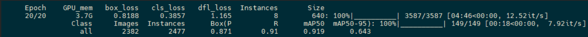
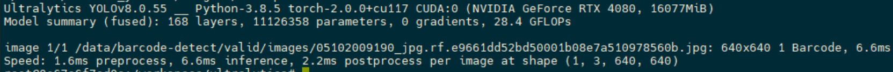
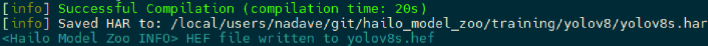
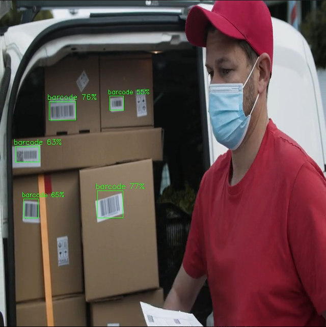

# Using YOLOv8 Retraining Docker

In this example, we're going to retrain the model to detect barcodes using the barcode-detector dataset from Kaggle. After the retraining process, we're going to convert the model to HEF and test it on the Raspberry Pi 5 AI Kit (or any X86 platform with a Hailo accelerator).

### NEW:
There is an alternative way to retrain and compile via Google Collab - Please refer to [yolov8s_hailo_retraining.ipynb](./yolov8s_hailo_retraining.ipynb)

#### This tutorial (training the model & compiling the result into HEF) was created on a development machine with the following specifications:

- CPU: Intel Xeon w7-3455
- GPU: 2x RTX 4500
- RAM: 202 GB
- OS: Ubuntu 24.04

## On the development machine

#### Preparations:
 
1. In order to easily download the Kaggle dataset via CLI on the development machine (which in many cases might be accessible only remotely via CLI): `pip install kagglehub`. Then go to the dataset page on Kaggle [barcode-detector](https://www.kaggle.com/datasets/kushagrapandya/barcode-detection) - click "Download" and copy-paste the Python code to a Python file (script) saved on the development machine. Then execute the script. This will download the dataset directly to the development machine to a location similar to: `~/.cache/kagglehub/datasets/kushagrapandya/barcode-detection/versions/1:/data`. Explore the folder structure, please pay attention to various data sets (test, train, valid), the structure - images & labels folders with corresponding by name samples (files) and how a label file looks like: object per row, leading class number (0-Barcode or 1-QR Code in our case) and then represented via bounding box coordinates.
2. Follow the instructions on the YOLOv8 retraining page: [YOLOv8 Retraining](https://github.com/hailo-ai/hailo_model_zoo/tree/833ae6175c06dbd6c3fc8faeb23659c9efaa2dbe/training/yolov8/)
    - In the "Build the docker image" section, in order to execute without cloning the model zoo git repo, a Dockerfile is required - It exists in the directory alongside the readme file (`~/hailo_model_zoo/training/yolov8`). Download it to the current directory and rename: `mv Dockerfile.txt Dockerfile`.
    - In the "Start your docker" section, please pay attention to the part about mapping (mounting) the location on the development machine where the Kaggle dataset was downloaded to the Docker container. For example: `~/.cache/kagglehub/datasets/kushagrapandya/barcode-detection/versions/1:/data` - This will add a volume mount named `data` to the Docker container. 
    
    **Throughout this tutorial we will assume `/data/`**

#### Launch the retraining

This process might take a couple of hours. It's possible to execute with `epochs=1` to expedite testing the process validity end-to-end before launching full-scale training.

```bash
yolo detect train data=/data/barcode-detect/data.yaml model=yolov8s.pt name=retrain_yolov8s epochs=20 batch=8
```

After the final epoch has finished, you should see a message like this:


#### Validate the new checkpoint

```bash
yolo predict task=detect source=/data/barcode-detect/valid/images/05102009190_jpg.rf.e9661dd52bd50001b08e7a510978560b.jpg model=./runs/detect/retrain_yolov8s/weights/best.pt
```
Expected output:


#### Convert the model to ONNX

Execute the CLI command within the container:

(Tip: How to run CLI commands within the container: `exit` the container, `sudo docker start <container_id>`, then `sudo docker exec -it <container_id> bash`, and the container will start with CLI).

```bash
yolo export model=/workspace/ultralytics/runs/detect/retrain_yolov8s/weights/best.pt imgsz=640 format=onnx opset=11
```

#### Export the ONNX to a directory mapped outside the Docker container

```bash
cp ./runs/detect/retrain_yolov8s/weights/best.onnx /data/barcode-detection.onnx
```

#### Exit the Docker 

1. Download Hailo Dataflow Compiler (DFC) & Hailo Model Zoo (HMZ) from the [Developer Zone](https://hailo.ai/developer-zone/software-downloads/). These are two `.whl` files.
2. Create a Python virtual environment, e.g., `python3 -m venv venv_dfc` and inside (`source venv_dfc/bin/activate`) pip install the two `.whl` files downloaded above (DFC & HMZ).

Make sure to be inside the venv.

#### Convert the ONNX to Hailo Executable Format (HEF)

Choose the corresponding YAML from [our networks configuration directory](https://github.com/hailo-ai/hailo_model_zoo/tree/833ae6175c06dbd6c3fc8faeb23659c9efaa2dbe/hailo_model_zoo/cfg/networks), i.e., `hailo_model_zoo/cfg/networks/yolov8s.yaml`.

`yolov8s_nms_config.json` file is required in a dedicated directory.

Create the directory manually and move the required JSON file there:
```bash
cd ~/lib/python3.12/site-packages/hailo_model_zoo/cfg/
mkdir postprocess_config
```
The JSON file can be found as follows: In the YAML file mentioned above, find the zip URL - download the file - unzip - copy the JSON file into the above `postprocess_config` directory.

Use the Hailo Model Zoo command (this can take up to hours):

```bash
hailomz compile \
--ckpt barcode-detection.onnx \
--calib-path <path to kaggle downloaded dataset - "valid" subdirectory> \
--yaml yolov8s.yaml \
--classes 2 \
--hw-arch <hailo8 or hailo8l or hailo10h> \
--performance
```
You should get a message like this: 


## The yolov8s.hef file is now ready and can be used on the Raspberry Pi 5 AI Kit

Load a custom model's HEF using the `--hef-path` flag. Default labels are [COCO labels](https://github.com/ultralytics/ultralytics/blob/main/ultralytics/cfg/datasets/coco.yaml) (80 classes). For custom models with different labels, use the `--labels-path` flag to load your labels file (e.g., `/resources/json/barcode_labels.json`).

Please note:

The Kaggle barcode dataset has 2 classes: ['Barcode', 'QR Code'].

YOLO assigns class IDs starting from 0:

Class 0 = 'Barcode'

Class 1 = 'QR Code'

Hailo Model Conversion: 

When YOLO models are converted to Hailo format, they allocate an extra class at index 0 for background/unlabeled detections. This shifts the actual classes:

Class 0 = 'unlabeled' (background)

Class 1 = 'Barcode'

Class 2 = 'QR Code'

### Running the detection application with the example retrained model
To download the example retrained model, run the following command:
```bash
hailo-download-resources --group retrain
```

The default package installation downloads the network trained in the retraining example above, which can be used as a reference (including `/resources/json/barcode_labels.json`).

Here is an example of the command line required to run the application with the retrained custom model:
```bash
python hailo_apps/python/pipeline_apps/detection/detection.py --labels-json resources/json/barcode_labels.json --hef-path resources/models/hailo8l/yolov8s-hailo8l-barcode.hef --input resources/videos/barcode.mp4
```

Example output:


