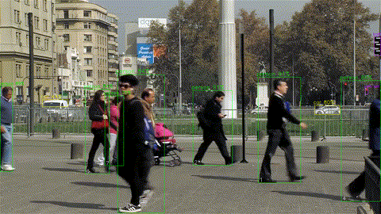

# Running Pre-built Applications

This guide explains how to run the ready-to-use AI applications included in this repository. Each application is a command-line tool designed to showcase a specific AI capability on Hailo hardware.

## Setup Environment
**Note:** This should be run on every new terminal session.
This will activate the virtual environment and set the PYTHONPATH.
```bash
source setup_env.sh
```

## Available Applications

The following applications are available. Each one is a self-contained GStreamer pipeline that can be launched with a simple command.

| CLI Command           | Application             | Description                                                                                                                                                       |
| --------------------- | ----------------------- | ----------------------------------------------------------------------------------------------------------------------------------------------------------------- |
| `hailo-detect-simple` | Simple Object Detection | A lightweight version focused on demonstrating raw Hailo performance with minimal CPU overhead. It uses a YOLOv6-Nano model and does not include object tracking. |
| `hailo-detect`        | Full Object Detection   | A comprehensive detection application featuring object tracking and support for multiple video resolutions.                                                       |
| `hailo-pose`          | Pose Estimation         | Detects human pose keypoints (e.g., joints and limbs) in real-time.                                                                                               |
| `hailo-seg`           | Instance Segmentation   | Provides pixel-level masks for each detected object, distinguishing different instances from one another.                                                         |
| `hailo-depth`         | Depth Estimation        | Estimates the depth of a scene from a single 2D camera input.                                                                                                     |
| `hailo-face-recon`    | Face Recognition        | A face recognition application that identifies and verifies faces in real-time. This application is currently in BETA.                                            |

## How to Run an Application

All applications can be run using their CLI command. For example, to start the simple object detection:

```bash
hailo-detect-simple
```
To close any application, press `Ctrl+C` in the terminal.



### Selecting an Input Source

By default, applications may use a pre-packaged video file. You can specify a different input source using the `--input` (or `-i`) flag.

**Run with a Raspberry Pi Camera:**
```bash
hailo-detect --input rpi
```

**Run with a USB Camera (Webcam):**
This command will automatically find and use the first available USB camera.
```bash
hailo-detect --input usb
```

**Run with a specific camera device:**
First, find your camera's device path. You can use a command like `ls /dev/video*` or our provided script:
```bash
get-usb-camera
```
Then, use the device path as the input:
```bash
hailo-detect --input /dev/video0
```

**Run with a video file:**
```bash
hailo-detect --input your_video.mp4
```

## Customizing with Command-Line Arguments

While the applications run out-of-the-box, you can customize their behavior using command-line arguments.

For a quick list of all options for any command, use the `--help` flag:
```bash
hailo-detect --help
```

All applications share a common set of arguments for controlling the input source, hardware, performance, and display settings.

---

## Command-Line Argument Reference

| Flag(s)                  | Description                                                                                                                                   |
| ------------------------ | --------------------------------------------------------------------------------------------------------------------------------------------- |
| `--input, -i <source>`   | Specifies the input source. Common options include: `rpi`, `usb`, a device path like `/dev/video0`, or a path to a video file.                |
| `--arch <architecture>`  | Manually sets the Hailo device architecture (e.g., `hailo8`, `hailo8l`, `hailo10h`). If not provided, the system will auto-detect the device. |
| `--hef-path <path>`      | Path to a custom compiled HEF model file, allowing you to run your own trained models.                                                        |
| `--show-fps, -f`         | Displays a real-time Frames-Per-Second (FPS) counter on the output video window.                                                              |
| `--frame-rate, -r <fps>` | Sets the target input frame rate for the video source. Defaults to 30.                                                                        |
| `--disable-sync`         | Disables display synchronization to run the pipeline at maximum speed. This is ideal for benchmarking processing throughput.                  |
| `--disable-callback`     | Disables the user-defined Python callback functions to measure the raw performance of the GStreamer pipeline itself.                          |
| `--dump-dot`             | Generates a `pipeline.dot` file, which is a graph of the GStreamer pipeline that can be visualized with tools like Graphviz.                  |
| `--labels-json <path>`   | Path to a custom JSON file containing the labels for the classes your model can detect or classify.                                           |
| `--use-frame, -u`        | In applications with a Python callback, this flag indicates that the callback is responsible for providing the frame for display.             |
